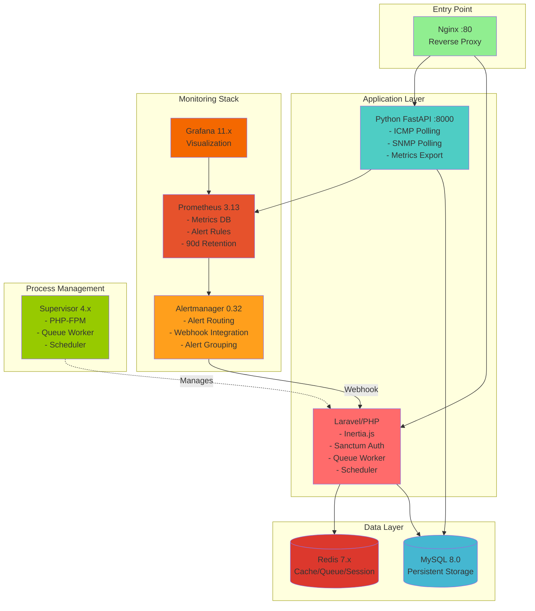

# Network Monitoring System

<div align="center">


**Enterprise-grade network monitoring and IT service management platform**

[](https://laravel.com)
[](https://reactjs.org)
[](https://python.org)
[](https://fastapi.tiangolo.com)
[](https://docker.com)
[](https://prometheus.io)
[](https://opensource.org/licenses/MIT)

</div>

---

## 📑 Table of Contents

- [Overview](#-overview)
- [Key Features](#-key-features)
- [Application Gallery](#-application-gallery)
- [Technology Stack](#-technology-stack)
- [Architecture](#-architecture)
- [Quick Start](#-quick-start)
- [Configuration](#-configuration)
- [Usage Guide](#-usage-guide)
- [Security Features](#-security-features)
- [Testing](#-testing)
- [Project Structure](#-project-structure)
- [Contributing](#-contributing)
- [License](#-license)
- [Author](#-author)
- [Acknowledgments](#-acknowledgments)

---

## 🌟 Overview

A comprehensive network monitoring and IT service management system that provides real-time device discovery, intelligent alerting, and complete ticket management capabilities. Built with a modern microservices architecture combining Laravel's robust backend with Python's high-performance network monitoring capabilities.

<div align="center">

### 🏢 Developed for Sancella Tunisia

**Industry**: Manufacturing - Hygiene & Personal Care Products  
**Location**: Charguia 1, Tunis, Tunisia  
**Products**: Libero, Peaudouce, Nana, Lotus, Tena, Tork

</div>

---

## ✨ Key Features

### 🔍 Intelligent Network Monitoring

<table>
<tr>
<td width="50%">

**Automated Discovery**
- SNMP-based device scanning
- Automatic device classification
- Network topology mapping
- Real-time device registration

</td>
<td width="50%">

**Continuous Monitoring**
- 30-second polling intervals
- ICMP ping + SNMP health checks
- Historical status tracking
- Response time metrics

</td>
</tr>
</table>


### 🚨 Smart Alerting System

- **Prometheus-powered metrics** - Industry-standard monitoring
- **Alertmanager integration** - Intelligent alert routing and grouping
- **Multi-channel notifications** - Email, in-app, and webhook support
- **Escalation policies** - Automatic task creation on device failures
- **Configurable intervals** - Group wait, group interval, and repeat interval controls

### 🎫 Complete IT Service Management

<table>
<tr>
<td width="33%">

**Task Management**
- Priority-based workflows
- Assignment tracking
- Observer notifications
- Project organization

</td>
<td width="33%">

**Intervention System**
- Approval workflows
- Quality ratings
- Status tracking
- Team collaboration

</td>
<td width="33%">

**Department Structure**
- Organizational hierarchy
- Resource allocation
- User management
- Access control

</td>
</tr>
</table>


### 📊 Advanced Analytics

- **Grafana dashboards** - Professional visualization
- **Custom metrics** - Device availability, response times, status changes
- **Historical analysis** - 90-day data retention
- **Real-time charts** - Live metric updates

---

## 🖼️ Application Gallery

<details>
<summary><b>👤 Authentication & Security</b></summary>


Multi-factor authentication, password recovery, and secure session management.

</details>

<details>
<summary><b>📈 Executive Dashboard</b></summary>


Comprehensive overview with key metrics, recent activities, and system health indicators.

</details>

<details>
<summary><b>🔍 Device Discovery</b></summary>


Automated SNMP-based network scanning with intelligent device classification.

</details>

<details>
<summary><b>💻 Device Management</b></summary>


Detailed device information including SNMP data, status history, and network topology position.

</details>

<details>
<summary><b>🏭 Equipment Management</b></summary>


Complete hardware inventory with maintenance tracking and assignment management.

</details>

<details>
<summary><b>📋 Intervention Workflows</b></summary>


Full intervention lifecycle with approval systems, status tracking, and quality ratings.

</details>

<details>
<summary><b>🏢 Department Organization</b></summary>


Hierarchical organization structure with user and resource management.

</details>

<details>
<summary><b>🔔 Real-time Notifications</b></summary>


Instant notifications for tasks, interventions, device alerts, and system events.

</details>

---

## 🏗️ Technology Stack

### Backend Services

<table>
<tr>
<td width="50%" valign="top">

#### Laravel Application


- RESTful API with Inertia.js
- Laravel Sanctum authentication
- Queue system with Redis
- Multi-channel notifications
- Observer pattern for events

</td>
<td width="50%" valign="top">

#### Python Monitoring Service


- Async ICMP ping (icmplib)
- SNMP polling (pysnmp)
- Prometheus metrics exporter
- 30-second polling loops
- Database write operations

</td>
</tr>
</table>

### Monitoring & Observability

<table>
<tr>
<td width="33%" align="center">


Time-series metrics database  
90-day retention  
Custom alert rules

</td>
<td width="33%" align="center">


Alert routing engine  
Webhook integration  
Alert grouping

</td>
<td width="33%" align="center">


Visualization platform  
Custom dashboards  
Real-time updates

</td>
</tr>
</table>

### Frontend

<table>
<tr>
<td width="50%">


</td>
<td width="50%">

- Inertia.js for SPA experience
- Chart.js for data visualization
- Three.js for 3D topology
- Framer Motion animations
- Heroicons & Lucide icons

</td>
</tr>
</table>

### Infrastructure

<table>
<tr>
<td width="25%" align="center">


Multi-container  
orchestration

</td>
<td width="25%" align="center">


Reverse proxy  
Load balancing

</td>
<td width="25%" align="center">


Cache, queue  
sessions

</td>
<td width="25%" align="center">


Process  
management

</td>
</tr>
</table>

---

## 🚀 Quick Start

### Prerequisites

- Docker & Docker Compose 24.x+
- Git
- 4GB RAM minimum (8GB recommended)

### Installation

```bash
# Clone repository
git clone https://github.com/trabelssi/network-monitoring-system.git
cd network-monitoring-system

# Configure environment
cp .env.example .env
cp docker/alertmanager/alertmanager.yml.example docker/alertmanager/alertmanager.yml

# Generate application key
docker compose exec php php artisan key:generate

# IMPORTANT: Edit docker/alertmanager/alertmanager.yml
# Replace CHANGE_ME_MATCH_INTERNAL_API_TOKEN with your INTERNAL_API_TOKEN from .env

# Start Docker stack
docker compose up -d

# Run migrations
docker compose exec php php artisan migrate

# (Optional) Seed database with demo data
docker compose exec php php artisan db:seed
```

### Access the Application

- **Application**: http://localhost
- **Grafana**: http://localhost:3000 (admin/admin_password)
- **Python Service Health**: http://localhost:8000/health

**Default Credentials**:
- Email: `admin@example.com`
- Password: `password`

⚠️ **Change default credentials immediately after first login**

---

## 📊 Architecture



---

## 🔧 Configuration

### Environment Variables

```env
# Application
APP_NAME="Network Monitoring"
APP_ENV=production
APP_DEBUG=false

# Database
DB_CONNECTION=mysql
DB_HOST=mysql
DB_PORT=3306
DB_DATABASE=network_monitoring
DB_USERNAME=laravel_user
DB_PASSWORD=your_secure_password

# Redis
REDIS_HOST=redis
CACHE_STORE=redis
QUEUE_CONNECTION=redis
SESSION_DRIVER=redis

# SNMP Configuration
SNMP_ENABLED=true
SNMP_VERSION=2
SNMP_COMMUNITY=public
SNMP_TIMEOUT=3000000
SNMP_RETRIES=3

# Python Service
POLL_INTERVAL=30

# Internal API (for Alertmanager webhook)
INTERNAL_API_TOKEN=your_generated_token_here

# Mail Configuration
MAIL_MAILER=smtp
MAIL_HOST=smtp.gmail.com
MAIL_PORT=587
MAIL_USERNAME=your_email@gmail.com
MAIL_PASSWORD=your_app_password
MAIL_ENCRYPTION=tls
```

### SNMP Community Strings

Edit `config/snmp.php` to add community strings for your network devices:

```php
'communities' => [
    'public',
    'private',
    'your_custom_community',
],
```

### Alert Rules

Customize alert thresholds in `docker/prometheus/alerts.yml`:

```yaml
groups:
  - name: device_alerts
    rules:
      - alert: DeviceDown
        expr: device_up == 0
        for: 5m  # Alert after 5 minutes down
        labels:
          severity: critical
        annotations:
          summary: "Device {{ $labels.hostname }} is down"
```

---

## 📖 Usage Guide

### Network Discovery

1. Navigate to **Network** → **Device Discovery**
2. Enter IP range (e.g., `192.168.1.0/24`)
3. Select SNMP version and community string
4. Click **Start Discovery**
5. Monitor real-time progress
6. Review discovered devices in **Network** → **Devices**

### Monitoring Dashboard

- Access Grafana at `http://localhost:3000`
- View pre-configured dashboards:
  - **Network Overview**: Device status, availability trends
  - **Device Details**: Per-device metrics and history
  - **Alert History**: Recent alerts and resolutions

### Task Management

1. **Tasks** → **Create New**
2. Enter task details (title, description, priority)
3. Assign to user/project
4. Add observers for notifications
5. Track progress and status updates

### Intervention Workflows

1. **Interventions** → **New Intervention**
2. Link to related task (optional)
3. Submit for approval
4. Track approval status
5. Rate completed interventions

---

## 🔒 Security Features

- **CSRF Protection**: All forms protected against cross-site request forgery
- **XSS Prevention**: Output escaping and Content Security Policy
- **SQL Injection Prevention**: Eloquent ORM with parameterized queries
- **Password Security**: Bcrypt hashing with configurable work factor
- **Rate Limiting**: API and authentication endpoint protection
- **Role-Based Access Control**: Admin/User permission system
- **Secure Headers**: HTTPS enforcement, HSTS, X-Frame-Options
- **Input Validation**: Server-side validation on all requests
- **Docker Security**: Non-root containers, capability restrictions

---

## 🧪 Testing

```bash
# PHP/Laravel tests
docker compose exec php php artisan test

# Python service tests
docker compose exec python-service pytest -v

# Run with coverage
docker compose exec php php artisan test --coverage
docker compose exec python-service pytest --cov=. --cov-report=html
```

---

## 📁 Project Structure

```
network-monitoring-system/
├── app/                          # Laravel application
│   ├── Http/Controllers/         # API & web controllers
│   ├── Models/                   # Eloquent models
│   ├── Jobs/                     # Background jobs
│   ├── Notifications/            # Notification classes
│   └── Services/                 # Business logic
├── python-service/               # Python monitoring service
│   ├── main.py                   # FastAPI application
│   ├── icmp_poller.py           # Ping implementation
│   ├── snmp_poller.py           # SNMP queries
│   ├── metrics.py               # Prometheus metrics
│   └── database_writer.py       # MySQL integration
├── resources/
│   ├── js/
│   │   ├── Pages/               # React pages
│   │   ├── Components/          # Reusable components
│   │   └── Layouts/             # Layout templates
│   └── views/                   # Blade templates
├── docker/
│   ├── prometheus/              # Prometheus configuration
│   ├── alertmanager/            # Alertmanager configuration
│   ├── grafana/                 # Grafana dashboards
│   └── nginx/                   # Nginx configuration
├── docker-compose.yml           # Docker orchestration
└── Dockerfile                   # PHP service image
```

---

## 🤝 Contributing

Contributions are welcome! Please follow these steps:

1. Fork the repository
2. Create a feature branch (`git checkout -b feature/amazing-feature`)
3. Commit your changes (`git commit -m 'Add amazing feature'`)
4. Push to the branch (`git push origin feature/amazing-feature`)
5. Open a Pull Request

---

## 📄 License

This project is licensed under the MIT License - see the [LICENSE](LICENSE) file for details.

---

## 👤 Author

**Amine Trabelsi**

[](https://github.com/trabelssi)
[](https://www.linkedin.com/in/trabelsi-mohamed-amine)
[](mailto:aminetrabls021@gmail.com)
[](https://trabelssi.github.io/)

**Role**: Software Developer  
**Company**: Sancella Tunisia

---

## 🙏 Acknowledgments

- **Sancella Tunisia (SO.TU.PA)** for project sponsorship and requirements
- IT team at Sancella Tunisia for feedback and domain expertise
- Open-source communities:
  - Laravel Framework
  - React & Inertia.js
  - Prometheus & Grafana ecosystems
  - Python FastAPI
  - Docker community

---

<div align="center">

**⭐ Star this repository if you find it useful!**

**🔗 [Documentation](https://github.com/trabelssi/network-monitoring-system/wiki) • [Report Bug](https://github.com/trabelssi/network-monitoring-system/issues) • [Request Feature](https://github.com/trabelssi/network-monitoring-system/issues)**

</div>
